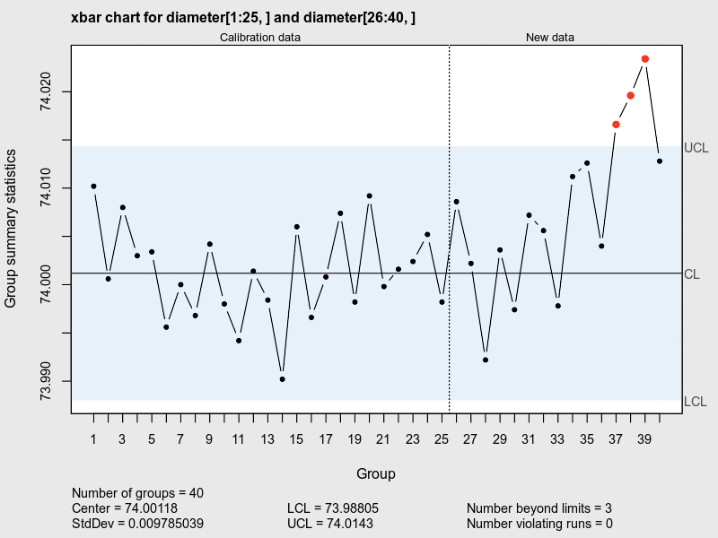

<!-- README.md is generated from README.Rmd. Please edit that file -->

```{r, echo = FALSE}
knitr::opts_chunk$set(
  collapse = TRUE,
  comment = "##",
  fig.path = "images/"
)
```

# qcc

An R package for **quality control charting and statistical process control**.

<center>

</center>
<br>

[](https://cran.r-project.org/package=GA)
[](https://cran.r-project.org/package=GA)

The **qcc** package provides quality control tools for statistical process control:

- Shewhart quality control charts for continuous, attribute and count data. 
- Cusum and EWMA charts. 
- Operating characteristic curves. 
- Process capability analysis. 
- Pareto chart and cause-and-effect chart. 
- Multivariate control charts.


## Installation

You can install the released version of qcc from CRAN:

```{r, eval = FALSE}
install.packages("qcc")
```

or the development version from GitHub:

```{r, eval = FALSE}
# install.packages("devtools")
devtools::install_github("luca-scr/qcc")
```

## Usage

Usage of the main functions and some examples are included in the following paper:

Scrucca, L. (2004) qcc: an R package for quality control charting and statistical process control. *R News* 4/1, 11-17. https://cran.r-project.org/doc/Rnews/Rnews_2004-1.pdf

which is available in the **Vignettes and other documentation** section of the help pages. 

See also the vignette *A quick tour of qcc*, which is available as

```{r, eval = FALSE}
vignette("qcc")
```

Note that if the package is installed from GitHub the vignette is not automatically created. However, it can be created when installing from GitHub with the code:

```{r, eval = FALSE}
devtools::install_github("luca-scr/qcc", build_vignettes = TRUE)
```

The vignette is also available in the *Get Started* section on the GitHub web page of the package at https://luca-scr.github.io/qcc/.
