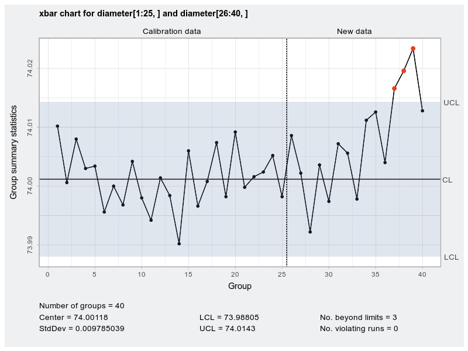

# qcc

[](https://cran.r-project.org/package=qcc)
[](https://cran.r-project.org/package=qcc)

<!-- 
# TODO: logo

-->

An [R](https://www.r-project.org/) package for **quality control charting and statistical process control**.

<center>

</center>
<br>

The **qcc** package provides quality control tools for statistical process control:

  - Shewhart quality control charts for continuous, attribute and count
    data.
  - Cusum and EWMA charts.
  - Operating characteristic curves.
  - Process capability analysis.
  - Pareto chart and cause-and-effect chart.
  - Multivariate control charts.

## Installation

You can install the released version of **qcc** from CRAN:

``` r
install.packages("qcc")
```

or the development version from GitHub:

``` r
# install.packages("devtools")
devtools::install_github("luca-scr/qcc", build_vignettes = TRUE)
```

## Usage

Usage of the main functions and some examples are included in Scrucca (2004). 
The vignette *A quick tour of qcc* is also available with the command:

``` r
vignette("qcc")
```

or through the GitHub web page of the package at <https://luca-scr.github.io/qcc/>.

## References

Montgomery, D.C. (2009) *Introduction to Statistical Quality Control*, 6th ed. New York: John Wiley & Sons.

Scrucca, L. (2004) [qcc: an R package for quality control charting and
statistical process control](http://www.stat.unipg.it/luca/misc/Rnews_2004-1-pag11-17.pdf). *R News* 4/1, 11-17. 

